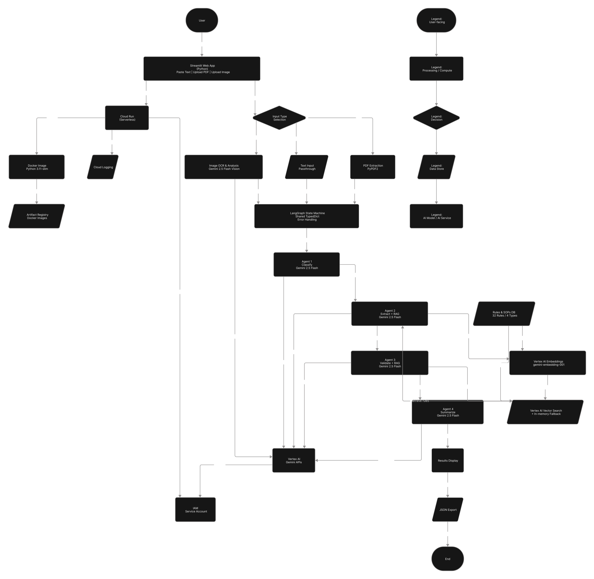

<div align="center">

# 📄 PwC Agentic Document Processor

### AI-Powered Multimodal Document Intelligence

[](https://python.org)
[](https://ai.google.dev/)
[](https://langchain-ai.github.io/langgraph/)
[](https://streamlit.io)
[](https://cloud.google.com/run)

*An enterprise-grade, agentic document processing pipeline that classifies, extracts, validates, and summarizes documents using a multi-agent architecture powered by Google's Gemini 2.5 Flash and LangGraph orchestration.*

[Features](#-features) · [Architecture](#-architecture) · [Quick Start](#-quick-start) · [Deployment](#-deployment) · [Documentation](#-documentation)

</div>

---

## 🔍 Overview

The **PwC Agentic Document Processor** is an intelligent document processing system that leverages a **4-agent pipeline** to automate the understanding and analysis of business documents. Each agent in the pipeline is a specialized AI module powered by **Gemini 2.5 Flash**, orchestrated seamlessly via **LangGraph** state machines.

The system supports **multimodal inputs** — paste text, upload PDFs, or submit images — and performs end-to-end processing including classification, field extraction, compliance validation against company rules (RAG), and executive summary generation.

---

## ✨ Features

| Feature | Description |
|---------|-------------|
| **🤖 4-Agent Pipeline** | Classification → Extraction → Validation → Summarization |
| **👁️ Multimodal Input** | Text paste, PDF upload, and image upload (Gemini Vision OCR) |
| **📚 RAG-Powered Validation** | Validates against company SOPs via Vertex AI Vector Search |
| **🔗 LangGraph Orchestration** | Stateful, deterministic agent workflow with error recovery |
| **📊 Executive Summaries** | Auto-generated highlights, action items, and risk assessments |
| **💾 JSON Export** | Download structured processing reports |
| **☁️ Cloud Run Ready** | One-command deployment with auto-scaling |
| **🛡️ Fault Tolerant** | Per-agent error handling with graceful fallbacks |

### Supported Document Types

- 📑 **Invoices** — Numbers, dates, line items, tax calculations, payment terms
- 📝 **Contracts** — Parties, terms, clauses, compensation, IP rights
- 📊 **Reports** — Metrics, trends, KPIs, recommendations
- 📧 **Emails** — Sender/recipient, sentiment, urgency, action items

---

## 🏗️ Architecture

The pipeline follows a sequential multi-agent pattern where each agent enriches a shared state object managed by LangGraph:

<div align="center">



</div>

```
┌──────────────┐    ┌──────────────┐    ┌──────────────┐    ┌──────────────┐
│   Agent 1    │───▶│   Agent 2    │───▶│   Agent 3    │───▶│   Agent 4    │
│ Classify     │    │ Extract      │    │ Validate     │    │ Summarize    │
│              │    │              │    │              │    │              │
│ Gemini Flash │    │ Gemini Flash │    │ Gemini Flash │    │ Gemini Flash │
│              │    │ + RAG Rules  │    │ + RAG Rules  │    │              │
└──────────────┘    └──────────────┘    └──────────────┘    └──────────────┘
                           │                    │
                           ▼                    ▼
                    ┌──────────────┐    ┌──────────────┐
                    │  Vertex AI   │    │  Company     │
                    │ Vector Search│    │  SOPs/Rules  │
                    └──────────────┘    └──────────────┘
```

### Agent Breakdown

| Agent | Role | Model | Input | Output |
|-------|------|-------|-------|--------|
| **Agent 1 — Classifier** | Determines document type | Gemini 2.5 Flash | Raw text | `doc_type`, `confidence`, `reasoning` |
| **Agent 2 — Extractor** | Pulls structured fields | Gemini 2.5 Flash | Text + RAG rules | `extracted_fields` (JSON) |
| **Agent 3 — Validator** | Checks compliance | Gemini 2.5 Flash | Fields + company SOPs | `is_valid`, `score`, `issues` |
| **Agent 4 — Summarizer** | Generates executive brief | Gemini 2.5 Flash | All prior results | `title`, `highlights`, `action_items`, `risks` |

---

## 🚀 Quick Start

### Prerequisites

- **Python 3.11+**
- **Google Cloud Project** with Vertex AI API enabled
- **gcloud CLI** authenticated (`gcloud auth application-default login`)

### Installation

```bash
# Clone the repository
git clone https://github.com/madhavmadupu/pwc-demo.git
cd pwc-demo

# Create a virtual environment
python -m venv venv
source venv/bin/activate  # On Windows: venv\Scripts\activate

# Install dependencies
pip install -r requirements.txt
```

### Configuration

Create a `.env` file in the project root:

```env
GOOGLE_CLOUD_PROJECT=your-project-id
GOOGLE_CLOUD_LOCATION=us-central1

# Optional: Vertex AI Vector Search (for production RAG)
VECTOR_SEARCH_ENDPOINT=projects/{project}/locations/{location}/indexEndpoints/{endpoint}
DEPLOYED_INDEX_ID=your-deployed-index-id
```

### Run Locally

```bash
streamlit run app.py
```

The app will be available at `http://localhost:8501`.

---

## ☁️ Deployment

### Deploy to Google Cloud Run

A deployment script is provided that handles API enablement, IAM configuration, and Cloud Run deployment:

```bash
chmod +x deploy.sh
./deploy.sh
```

The script will:

1. Enable required GCP APIs (Cloud Run, Cloud Build, Vertex AI, Storage)
2. Configure IAM roles for the compute service account
3. Build and deploy the containerized app to Cloud Run
4. Output the public URL

### Manual Docker Build

```bash
# Build the container
docker build -t pwc-agentic-demo .

# Run locally
docker run -p 8080:8080 \
  -e GOOGLE_CLOUD_PROJECT=your-project-id \
  -e GOOGLE_CLOUD_LOCATION=us-central1 \
  pwc-agentic-demo
```

### Cloud Run Configuration

| Parameter | Value |
|-----------|-------|
| Memory | 2 GiB |
| CPU | 2 vCPU |
| Min Instances | 0 (scale to zero) |
| Max Instances | 5 |
| Port | 8080 |

---

## 📁 Project Structure

```
pwc-demo/
├── app.py                  # Main Streamlit application with all 4 agents
├── requirements.txt        # Python dependencies
├── Dockerfile              # Container configuration for Cloud Run
├── deploy.sh               # One-click Cloud Run deployment script
├── .env                    # Environment variables (git-ignored)
├── docs/
│   ├── architecture.svg    # System architecture diagram
│   └── scalability.md      # Vertex AI scalability & model comparison
├── notebooks/
│   ├── 01_classification_agent.ipynb   # Agent 1 development notebook
│   ├── 02_extraction_agent.ipynb       # Agent 2 development notebook
│   ├── 03_validation_agent.ipynb       # Agent 3 development notebook
│   └── 04_summary_agent.ipynb          # Agent 4 development notebook
└── sample_docs/            # Sample documents for testing
```

---

## 🛠️ Tech Stack

| Component | Technology | Purpose |
|-----------|-----------|---------|
| **LLM** | [Gemini 2.5 Flash](https://ai.google.dev/gemini-api/docs/models#gemini-2.5-flash) | Multimodal reasoning & structured output |
| **Vision/OCR** | Gemini Vision (Multimodal) | Image-to-text extraction |
| **Orchestration** | [LangGraph](https://langchain-ai.github.io/langgraph/) | Stateful agent pipeline & workflow |
| **RAG** | Vertex AI Vector Search | Company rule retrieval |
| **Frontend** | [Streamlit](https://streamlit.io) | Interactive web UI |
| **Deployment** | [Google Cloud Run](https://cloud.google.com/run) | Serverless containerized hosting |
| **Container** | Docker (Python 3.11 slim) | Reproducible builds |

---

## 📚 Documentation

| Document | Description |
|----------|-------------|
| [Scalability & Model Comparison](docs/scalability.md) | Vertex AI rate limits, model pricing, enterprise scaling strategies |
| [Architecture Diagram](docs/architecture.svg) | Visual system architecture |
| [Agent Notebooks](notebooks/) | Step-by-step development notebooks for each agent |

---

## 🔐 Security

- **No hardcoded credentials** — uses GCP Application Default Credentials
- **Environment variables** for all configuration
- **`.env` is git-ignored** to prevent secret leakage
- **Vertex AI IAM** — least-privilege service account roles

---

## 📈 Scaling for Production

For enterprise-scale deployments processing **10,000+ documents/day**, refer to the [Scalability Guide](docs/scalability.md) for detailed recommendations on:

- **Batch Processing** — 50% cost reduction via Vertex AI Batch API
- **Context Caching** — 90% savings on repeated system prompts
- **Provisioned Throughput** — Guaranteed capacity with GSU reservations
- **Model Tiering** — Flash-Lite for simple tasks, Pro for complex reasoning

---

## 🤝 Contributing

Contributions are welcome! Please follow these steps:

1. Fork the repository
2. Create a feature branch (`git checkout -b feature/amazing-feature`)
3. Commit your changes (`git commit -m 'feat: add amazing feature'`)
4. Push to the branch (`git push origin feature/amazing-feature`)
5. Open a Pull Request

---

## 📄 License

This project is for demonstration purposes. Please contact the repository owner for licensing information.

---

<div align="center">

**Built with ❤️ using Google Gemini, LangGraph, and Streamlit**

</div>
